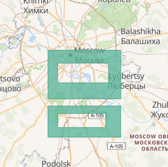

# PoC City Service with GeoJSON

## Links

 - [GeoJSON spec](https://geojson.org/)
 - [RFC7946](https://www.iana.org/assignments/media-types/application/geo+json)

## Использование структуры GeoJSON

- `FeatureCollection` - контейнер объектов, в роли объектов выступают города.
- `Feature` - геометрический объект со свойствами, в роли объекта выступает город.
- `Polygon` и `MultiPolygon` - геометрия объекта.

### Пример:



```json
{
  "type": "FeatureCollection",
  "features": [
    {
      "type": "Feature",
      "properties": {
        "id": "city-1",
        "name": "City 1",
        "description": "This city is two rectangle with holes", 
      },
      "geometry": {
        "type": "MultiPolygon",
        "coordinates": [
          [
            [
              [ 37.50526428222656,  55.627220636248104 ],
              [ 37.86712646484375,  55.627220636248104 ],
              [ 37.86712646484375,  55.76382685625667  ],
              [ 37.50526428222656,  55.76382685625667  ],
              [ 37.50526428222656,  55.627220636248104 ]
            ],
            [
              [ 37.55332946777344,  55.672550948546444 ],
              [ 37.80601501464844,  55.672550948546444 ],
              [ 37.80601501464844,  55.72749675732418  ],
              [ 37.55332946777344,  55.72749675732418  ],
              [ 37.55332946777344,  55.672550948546444 ]
            ]
          ],
          [
            [
              [ 37.50526428222656,  55.51930211717438  ],
              [ 37.86643981933594,  55.51930211717438  ],
              [ 37.86643981933594,  55.607444843865984 ],
              [ 37.50526428222656,  55.607444843865984 ],
              [ 37.50526428222656,  55.51930211717438  ]
            ],
            [
              [ 37.55401611328125,  55.546503784568614 ],
              [ 37.791595458984375, 55.546503784568614 ],
              [ 37.791595458984375, 55.5861068280353   ],
              [ 37.55401611328125,  55.5861068280353   ],
              [ 37.55401611328125,  55.546503784568614 ]
            ]
          ]
        ]
      }
    }
  ]
}

```
